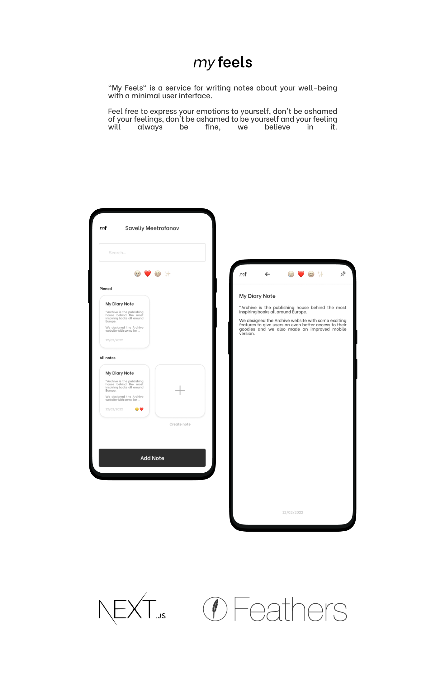

## My Feels Web Application

"My Feels" is a service for writing notes about your well-being with a minimal user interface.

Feel free to express your emotions to yourself, don't be ashamed of your feelings, don't be ashamed to be yourself and
your feeling will always be fine, we believe in it.

## Tech Stack

- **[NodeJS]** - Node.js® is a JavaScript runtime built on Chrome's V8 JavaScript engine
- **[TypeScript]** - TypeScript extends JavaScript by adding types to the language
- **[FeathersClient]** - Client to work with the API
- **[ReactJS]** - A JavaScript library for building user interfaces
- **[Redux/React-Redux]** - A Predictable State Container for JS Apps
- **[Figma]** - Interface development

## Design

The design is all done by me. Icons to take from [Flaticon]

Design instruments: [Figma]

[nodejs]: https://nodejs.org/en/
[feathersclient]: https://docs.feathersjs.com/api/client.html#node
[reactjs]: https://reactjs.org/
[electronjs]: https://www.electronjs.org/
[typescript]: https://www.typescriptlang.org/
[stylus]: https://stylus-lang.com/
[redux/react-redux]: https://react-redux.js.org/
[webpack]: https://webpack.js.org/
[figma]: https://www.figma.com/
[open-sans]: https://fonts.google.com/specimen/Open+Sans
[google-fonts]: https://fonts.google.com/
[flaticon]: https://www.flaticon.com/
[yarn]: https://yarnpkg.com/
[behance]: https://www.behance.net/gallery/120582893/BLUSH-Music-App
[dribbble]: https://dribbble.com/shots/15761581-BLUSH-Music-App
[electron-forge]: https://www.electronforge.io/
[cormorant-garamond]: https://fonts.google.com/specimen/Cormorant+Garamond?query=Cormorant+Garamond

 

Made with love ❤️

I'm on Telegram: **@ssandry0** \
I'm on Behance: **https://www.behance.net/aftertaste** \
I'm on Dribbble: **https://dribbble.com/ssandry0**
